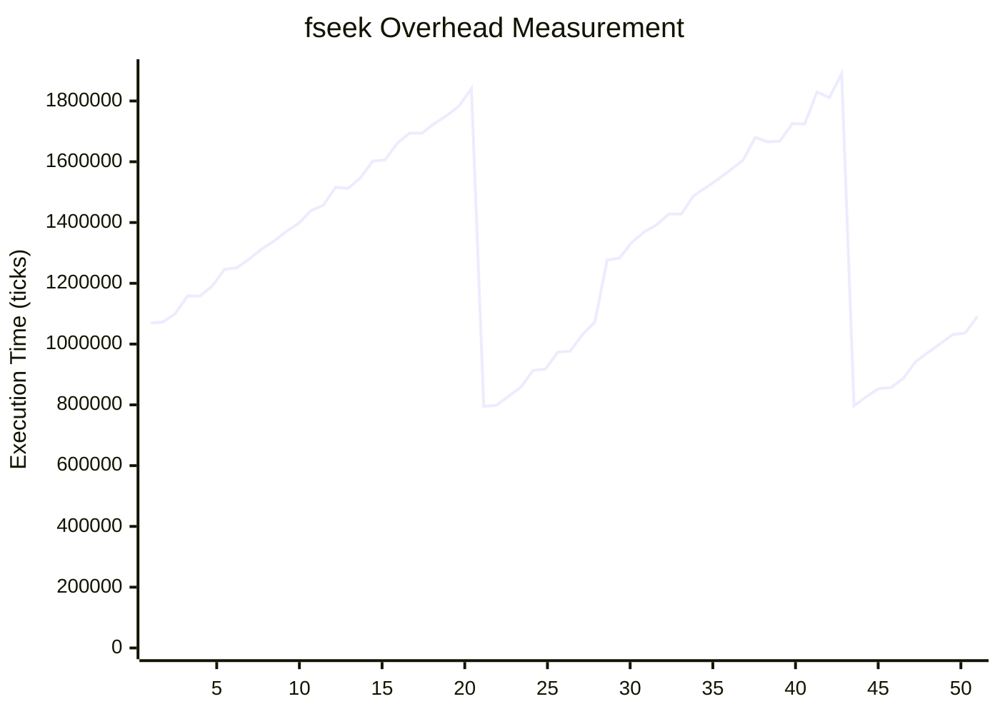

# File system

>⚠️ **Warning:** The `prj.conf` contains network configuration. It is highly recommended to run the bench with a network cable connected, because otherwise at boot the network stack will try to connect to the network and will slow down the boot process.

## `littlefs` comportment
The filesystem performance tests showed some strange behavior that should be linked to `littlefs` implementation. 

Mostly with the tests of: 
* **fopen**
    ```mermaid
    xychart-beta
        title "Performance fopen: WASM vs Native"
        x-axis 1 --> 50
        y-axis "Execution Time (ticks)" 0 --> 2100000
        line [838193, 867759, 891392, 920960, 952162, 973984, 997624, 1034763, 1050741, 1079506, 1103882, 1133053, 1157042, 1184516, 1208845, 1238652, 1261927, 1291956, 1315537, 1345096, 1368670, 1416986, 1421887, 1452552, 1476425, 1505105, 1535479, 1557720, 1581767, 1611851, 1635011, 1664393, 1688321, 1717487, 1741536, 1771043, 1794877, 1824437, 1851405, 1877631, 1900297, 1932273, 1954674, 1983747, 2007785, 2036926, 2060590, 784765, 826129, 838178, 871767]
        line [116810, 128621, 142051, 155957, 169614, 182618, 196283, 209199, 222807, 235753, 249535, 262384, 276104, 287956, 302418, 315569, 329250, 341830, 355968, 368830, 382670, 395485, 409233, 422116, 435864, 448652, 462465, 474344, 489127, 501634, 515847, 528698, 542508, 555356, 568691, 582039, 595087, 608792, 622081, 635339, 648775, 660875, 675798, 687931, 702354, 715158, 717215, 89542, 101735, 115782, 128310]
    ```
* **mkdir**
    ```mermaid
    xychart-beta
        title "Performance mkdir: WASM vs Native"
        x-axis 1 --> 20
        y-axis "Execution Time (ticks)" 0 --> 2800000
        line  [2262033, 2356699, 2430975, 2472047, 2538805, 2639597, 2706809, 2762363, 1068714, 1109284, 1204127, 1277304, 1345767, 1413801, 1486880, 1528108, 1622655, 1695877, 1737580, 1806800]
        line  [1008022, 1007920, 1034293, 1090093, 1116095, 1114462, 1170650, 499646, 526384, 526848, 581307, 608865, 609884, 664269, 689949, 718844, 718826, 771007, 773469, 828295]
    ```
* **unlink** 
    ```mermaid
    xychart-beta
        title "Performance Comparison: WASM vs Native"
        x-axis 1 --> 20
        y-axis "Execution Time (ticks)" 0 --> 3500000
        line [1720424, 1384821, 190666, 243190, 299575, 353478, 405292, 460067, 514748, 566612, 621927, 677566, 728833, 784077, 838839, 891586, 948454, 1001885, 1055030, 1108504]
        line [1308055, 3242023, 167378, 221784, 274583, 329271, 384758, 436701, 491431, 546787, 598866, 654602, 707927, 761328, 816921, 871733, 923219, 978186, 1032453, 1084702]
    ```
    >📄 **Notes:** Here we also see an unexplained peak for native, but we clearly see the drop at the start. This case was unlink on directories.
* **rename** 
    ```mermaid
    xychart-beta
        title "Performance rename: WASM vs Native"
        x-axis 1 --> 20
        y-axis "Execution Time (ticks)" 0 --> 9000000
        line [1635395, 1785028, 1932533, 2081011, 2230079, 2376957, 2527145, 2675095, 215511, 360116, 509444, 659660, 805615, 956030, 1104519, 1253122, 1401337, 1551701, 1699143, 1848857]
        line [1634242, 1783772, 1933736, 2080788, 2229072, 2378112, 2525581, 8324668, 213434, 363572, 509397, 659167, 808260, 956606, 1105954, 1255672, 1402538, 1553190, 1702692, 1850473]
    ```
    >📄 **Notes:**  Native had a spike at 8 but the reason is not identified.

We observe a performance degradation test after test, and after a number of tests it go back to normal. It show a periodic behavior.

The performance test `perf` showed that the period is around 70 rounds of open / write / seek / read / close / unlink.

In the github repository we can find about 45 opened issues with th performance tag, some of the issues: 
* [Open speed and cache sizes](https://github.com/littlefs-project/littlefs/issues/783)
* [Open and Close File Performance](https://github.com/littlefs-project/littlefs/issues/214)
* [v2.7 : long delay in open/close for spi nor](https://github.com/littlefs-project/littlefs/issues/965)
* [Zephyr OS little FS file system Write timeing issue](https://github.com/littlefs-project/littlefs/issues/935)

## About the `fwrite` test
The test of `fwrite` is highly suspicious as we observe that wasm is up to 66 times faster than native. It is possible that the `fwrite` implementation is not working as expected.

| size | wasm    | native   | r or 1/r    |
| :--: | ------: | ------:  | ----------: |
| 13   | 327460  | 74380    | 4.40 (r)    |
| 256  | 300900  | 1357280  | 4,51 (1/r)  |
| 512  | 334420  | 17059106 | 51.01 (1/r) |
| 1024 | 399460  | 26378326 | 66.03 (1/r) |

During measure of overhead we came to the conclusion that the time measure is unexpectedly performed before the write operation. 

* source code:
    ```c
        bench_start();
        rc = fwrite(text_1024, sizeof(char), 1024, file);
        bench_end();
    ```

* output:
    ```bash
    [fs_write] fopen returned 0x3930
    [DEBUG] measure start time
    [DEBUG] measure end time
    [overhead] end : 833535020       # Here measure after end
    [fs_write] fwrite returned 1024
    [00:00:04.491,000] <inf> main: wasi exit code: 0
    [fs_fwrite] start: 831989452 ticks
    [fs_fwrite] end: 832561085 ticks
    [fs_fwrite] elapsed: 571633 ticks
    ```
    >📄 **Notes:** We purposely added print into the `bench_start()` and `bench_end()` functions to show that the time measure is performed before the write operation.
    Also the `[overhead] ...` log come from a print just before the native call in WAMR `os_` api.

Ususally the output should look like the following (e.g: for `fread`): 
```bash
[fs_read] fopen returned 0x3970
[DEBUG] measure start time
[overhead] end : 1058116728
[DEBUG] measure end time
[fs_read] fwrite returned 1024
[fs_read] fseek returned 0
[fs_read] fread returned 1024
[00:00:05.427,000] <inf> main: wasi exit code: 0
[fs_fread] start: 1057553683 ticks
[fs_fread] end: 1058739068 ticks
[fs_fread] elapsed: 1185385 ticks
```

Some investigations were performed but we were unable to find the root cause of this issue.

## About the `fseek` test
In the `fseek` test we also observed the same time increase as the `fopen`, `mkdir`, ... test. At first we thought it was due to the `littlefs` implementation. 

But after performing the overhead measure we observed that the overhead keep growing test after test. 




We can remove our implemenation from the equation as there is no risk of memory leak in our code:
```c
__wasi_errno_t
os_lseek(os_file_handle handle, __wasi_filedelta_t offset,
         __wasi_whence_t whence, __wasi_filesize_t *new_offset){
    struct zephyr_fs_desc *ptr = NULL;
    int zwhence;

    GET_FILE_SYSTEM_DESCRIPTOR(handle->fd, ptr);

    // They have the same value but this is more explicit
    switch(whence){
        case __WASI_WHENCE_SET:
            zwhence = FS_SEEK_SET;
            break;
        case __WASI_WHENCE_CUR:
            zwhence = FS_SEEK_CUR;
            break;
        case __WASI_WHENCE_END:
            zwhence = FS_SEEK_END;
            break;
        default:
            return __WASI_EINVAL;
    }

    off_t rc = fs_seek(&ptr->file, (off_t)offset, zwhence);
    if(rc < 0){
        return convert_errno(-rc);
    }

    *new_offset = (__wasi_filesize_t)rc;

    return __WASI_ESUCCESS;
}
```
**Hypothesis:** There should be a memory leak somewhere in either the WAMR runtime or the wasi-libc implementation.

We need to investigate further. May be same test could be performed on `Linux` to see if the issue is related to the `wasi-libc` implementation or the WAMR runtime.